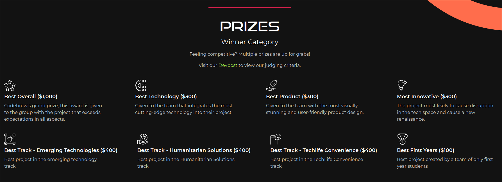
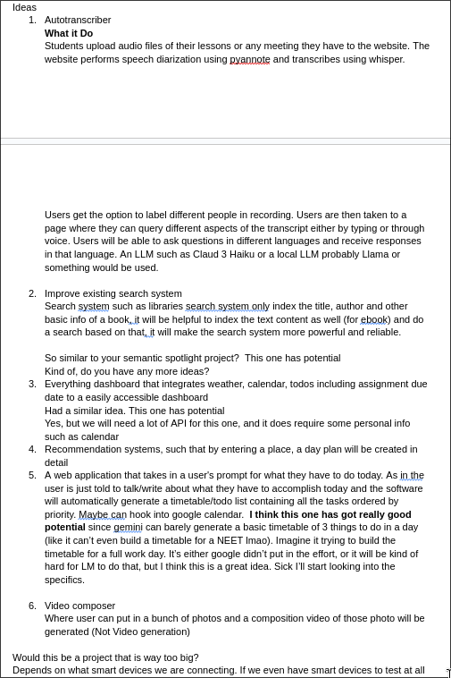
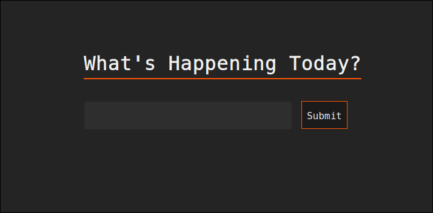
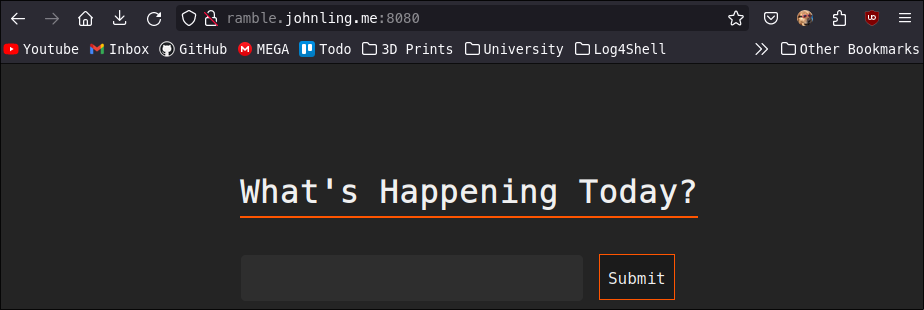
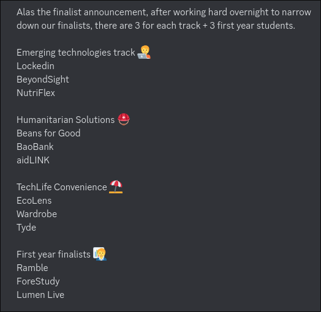
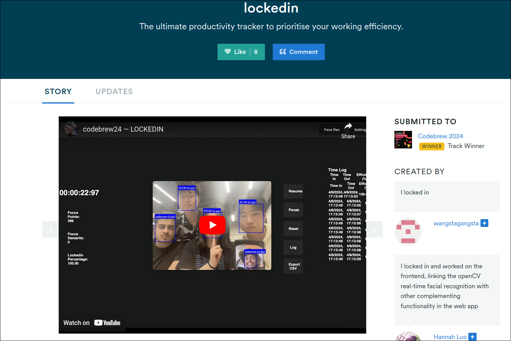
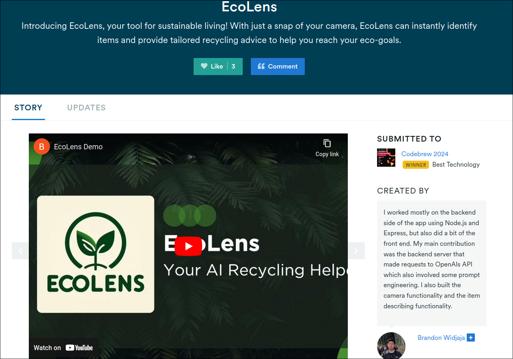
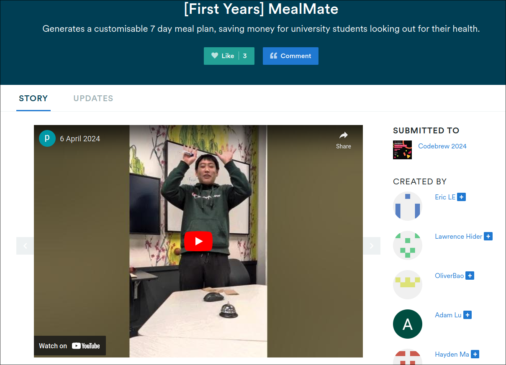

# Entering a Hackathon
_22/04/2024_

About maybe 2 weeks ago from writing this article. I participated in a hackathon at my university. It was a fun experience that I'd like to write about. 

Prior to the event. I had very little experience ever doing hackathons. I think the only things similar to such an event was a coding contest at my school and one online hackathon in 2020. So I wasn't really familiar with the whole hackathon. However something on the website caught my eye.

## Money

This event was known as the CODEBREW 2024 hackathon. Which was CISSA's (The big computer science society at the University of Melbourne) "flagship hackathon" so for such a big hackathon there would be big prizes.


_$3500 worth of prizes._

And indeed there was with a top cash price of $1000. In my greed (and in hindsight delusion), I reached out to my friends and we formed a group since it would have been a fun activity for us to do over the mid-semester break with the potential for at least $100. I don't want to dox my friends so I'll be naming them F and N respectively. 

## The actual event

Unfortunately, I wasn't in the country :( I was in Malaysia at the time so unfortunately I had to attend the Hackathon virtually. So this meant most of my time was spent at my laptop. 


_Photo of me back in Malaysia during the hackathon._

Although from what I heard from my friends there was coffee and red bull that was served for free during the event and apparently you could stay overnight at the venue if you really want that no-life™ experience. 

They also served food of varying quality. Apparently my friend received 

_"One sixth of a subway sandwich for lunch"_

A day before the event we spent some time trying to come up with ideas. We only had 2 days for actual programming (last day was reserved for finalists) so we wanted to hit the ground running and not spend any time coming up with ideas.

Contestants could make a project under any of these 3 categories.
- Techlife Convenience
- Emerging Technologies
- Humanitarian Solutions

we chose the topic of "Techlife Convenience" and started passing around ideas from an transcriber for lectures, an educational assistant or but eventually we settled on a software that received natural language and turned it into some sort of timetable or todo list.

So we had the idea now we actually had to build it.

## Day 0

At the time we didn't know about the name of our app I mean we didn't even know our team name (we literally went under team "Cissa hackathon thing") but I had a name in mind from the start called "Ramble".

Since the data being sent into the app would be just someone typing. The idea would be the user would just type about their tasks and things to do into the software. It wouldn't have to be formal or even coherent hence it would be considered a "ramble". 

Although I had the name I wouldn't suggest it until much later since we were more concerned about the technical specifics. 



_Our google doc with our ideas we conversed using the doc I'm not talking to myself._

## Day 1
F and N started at the venue and I started from my bedroom. We had delegated the tasks between us. 

Me:
- Frontend
- Deployment

F:
- Backend

N:
- UI Design
- Video Editing

We communicated primarily on Discord and we all knew what tasks we wanted so all got to work. I worked on the frontend using ReactJS. The UI was pretty simple. 

Minimalist, if you will.




_I'm embarassed to say this took longer then it should have_


By this point F had finished with the backend section so I pulled his changes and made some modifications to ensure CORS didn't throw a fit.
I then connected it to the frontend and pretty much we had a pretty decent prototype. 

## Day 2

For the second day I worked a bit more on the frontend. Although F didn't have much experience using React he did a bit of work which was helpful. 

By that point we had pretty much the entire application done and it was time to deploy it. We even had a custom logo designed by N. I asked N to start working on a demo video and we drafted and recorded a script. Now that N was working on the video I just had to deploy the app.

That shouldn't be difficult right? 

<br>
<br>
<br>
<br>
<br>
<br>
<br>
<br>
<br>
<br>
<br>
<br>
<br>
<br>
<br>
<br>
<br>
<br>
right?
<br>
<br>
<br>
<br>
<br>
<br>
<br>
<br>
<br>
<br>
<br>
<br>
<br>
<br>
<br>
<br>
<br>
<br>


### John's Trip Through Deployment Hell

Initially I thought we were being too unambitious with our app since in the grand scheme of things it was pretty basic. However in hindsight I'm glad we only spent a day and a half on the app since deployment was probably the most difficult part.

I had very little if any experience using docker beyond deploying pre-made images on my server. 

The entire process was a cycle of 

``` basic
10 Watch the video

20 Try to write the Dockerfile

30 Test the image

40 Fail

50 Read the documentation

60 Question if you even understand the fundamentals

70 Read the documentation about Docker

80 Cry

GOTO 10
```
_Repeat for like 4 hours_ 

The main problem was caused by my confusion about how NGINX in Docker would work alongside the instance that was already running on my server. 

The main solution for this would be to run a reverse proxy that points to the IP of my container but no matter how much I tried I just could not get it working.

It was 4pm and we had to submit our video and I wanted to have our app deployed by then for the judges to test themselves. So running out of options, I pulled a dirty workaround and hosted the website on port 8080.


_The lack of HTTPS adds just tasteful amount of scuffed to the final product_

After filling in all the forms to submit we submitted our Github repository, our demo video and the URL to our app. 

By then it would be up to the judges to determine whether we get to the finals and we would know by tomorrow morning. On that same day, I had to return to Melbourne so I boarded the plane and went to sleep. 

## Day 3

It's the morning now and I'm in an uber coming out the airport. I get a message on my phone from F. 

WE GOT INTO THE FINALS!!!!!!!!11!



I'll be honest I was surprised we even got this far considering our competition. On the website we submitted Devpost, you could view other projects submitted by competitors. I won't lie some of the submissions were pretty cracked.


_These people locked in hard and I was expecting them to win._


_My friend really liked this one and I have to agree._


_This one didn't get into the finals and tbh it really should have. If you guys ever read this somehow, you guys were scammed IMO._

Honestly I attributed our final placement to the video created by N. It was a really well edited video and I think that improved our app's strength. Our app logo and in my opinion general coherence of the UI with the consistent orange and grey colour scheme made it pretty professional and almost took people's attention away from the scuffed hosting solution. Almost.

Regardless of how we got into the finals, we had to prepare a presentation to pitch to the judges and we had some really strong judges. All of them were software engineers at Atlassian, Google and AirWallex (Melbourne based startup).

Ironically I saw 2 of my previous school friends under another finalist team named Lumen Live so seeing them was pretty funny. 

We went through the pitch which I think went ok. We had a bit of a problem moving the windows from my laptop onto the projector due to something weird about Hyprland but otherwise it went well.

Everyone went through their pitches and the judges left to determine the winner. 

A bit of time passed and they came back and announced the winners.
We won the prize for "Best First Years" which was pretty cool (though not unexpected haha). Although there was another prize for "Best product" which was snagged by another first year team which was a bit odd but I digress. 

To their credit they did have more features then us and it was honestly a really cool product. I think if we had added some more basic features to Ramble we could've stood a better chance. 


### Huffing Some Copium
There was a huge range of participants while we were a group comprised of first year students, one of the other teams contained Master's students. 

After a quick LinkedIn search prior to pitching all of the participants within the categories except the "Best First Year" were 2nd or 3rd year students. It would make more sense for the university to award the higher prizes to the Master's, 2nd and 3rd year students since it would benefit their resumes since they were the ones actively looking for jobs or internships which is completely fair.

I realised that as first year students were probably weren't even in consideration for the big prizes and were limited to the first year prize. At that point the focus was on winning the "Best First Year" prize and maybe one of the other prizes for either "Best Product" or "Most Innovative".

ok ok huffing over

## Conclusion

Overall while we didn't make the $1000 that hoped for, we all had a lot of fun and I'll definitely be developing Ramble as a software. The idea for Ramble was something that I personally wanted in my life and I think it has potential.

Top priority would be to fix that god-awful hosting solution to something reasonable then probably add some more features. Later I might bring F on since it could be fun. Who knows maybe this could be another startup to burn VC money haha. Unless?


