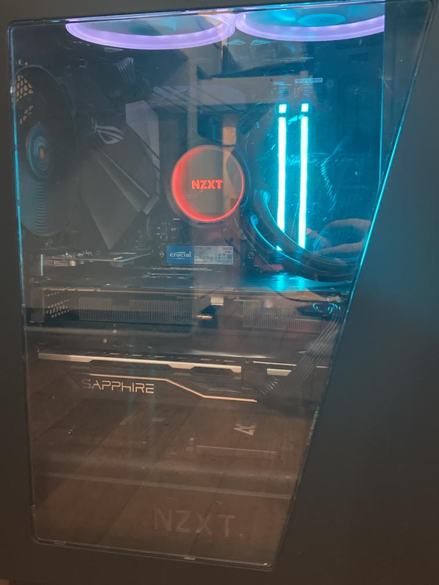
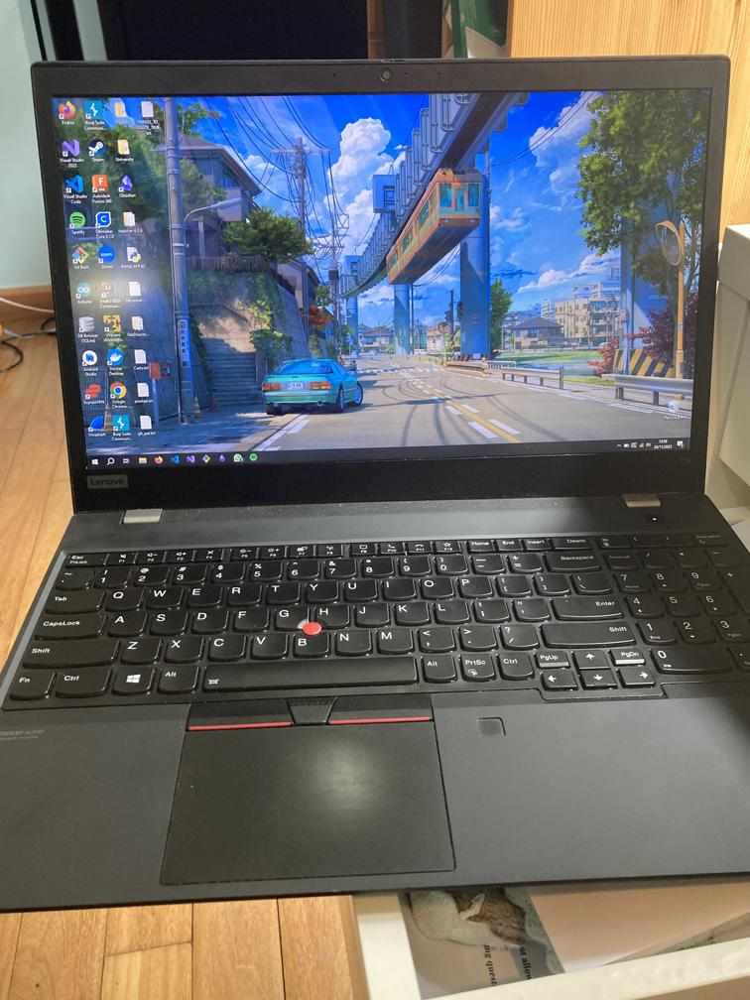
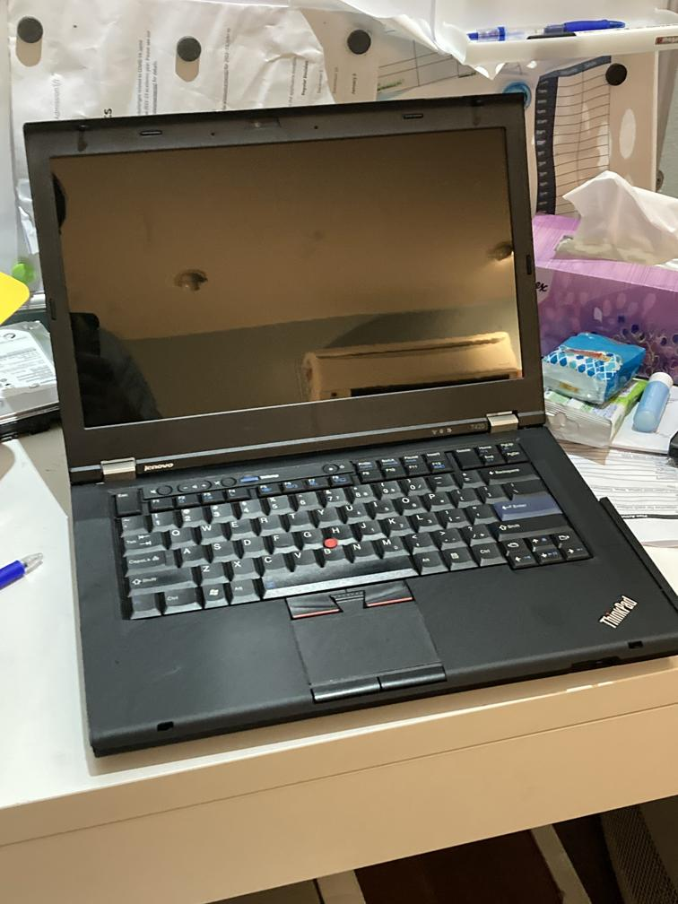
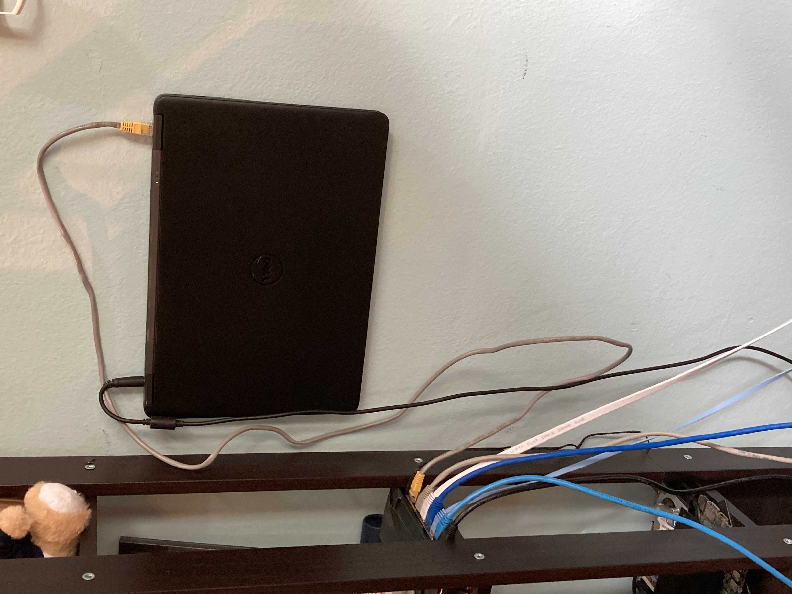

# My Entire System in Depth
_13/11/2023_

On the tech page of my website, I do list some of the software and hardware I use on a daily basis. However that does not even begin to cover everything I use so this article goes through nearly everything I use in stupid amounts of detail.

## The Software


_My Linux desktop_

**OS**: Since I mainly do programming and play a total of 1 game on my computer, Linux is the best choice for me. I daily drive Arch<sub>btw</sub> Linux not because I worship the KISS philosphy (although I think simple > complicated) nor is it out of some weird sense of superiority I can hold over Ubuntu users.
 
I use Arch Linux becaues it was my first and only distro and I literally don't know how to use anything else on the desktop. 

**WM**: I use Hyprland just for the cool animations. I use a lot of virtual desktops and the previous WMs I tried such as I3 don't seem to support it at least not out of the box. I use Hyprland with a [virtual desktop plugin](https://github.com/levnikmyskin/hyprland-virtual-desktops) that can move all workspaces on my monitors at once rather than individually. 

Since I like using 4 statically assigned desktops, I some basic edits to prevent adding any new desktops after 4.

```diff
void VirtualDeskManager::nextDesk(bool cycle) {
    int nextId = activeVdesk()->id + 1;
+	if (nextId > 4) 
+   {
+	    return;
+	}
-   if (!cycle) {
-       changeActiveDesk(nextId, true);
-   }  else  {
-       nextId = vdesksMap.contains(nextId) ? nextId : 1;
-       changeActiveDesk(nextId, true);
-   }
+	changeActiveDesk(nextId, true);
+	return;
}
```

```diff
void VirtualDeskManager::previousDesk() {
+    if (activeVdesk()->id - 1 < 1)
+    {
+        return;
+    }
+    changeActiveDesk(activeVdesk()->id - 1, true);
+    return;
-    int nextId = activeVdesk()->id + 1;
-    if (!cycle) {
-        changeActiveDesk(nextId, true);
-    } else {
-        nextId = vdesksMap.contains(nextId) ? nextId : 1;
-        changeActiveDesk(nextId, true);
-    }
}
```

**Terminal**: I use Alacritty with the default theme provided by Hyprland. No particular reason for choosing Alacritty over something like Kitty. I just think it as a cooler name. 

**Browser**: I see a lot of techy people using things like Brave or straight Chromium but I'm basic so I just use Firefox with the default dark theme and a few extensions. I use Ublock Origin for my adblocker since it works despite Youtube's ongoing crusade against adblockers. It also has the HTML "zapper" which helps be bypass paywall popups on article websites. 

I also use a modified version of the Tabliss extension. I added a widget that can display my Trello list right at the homepage since I like seeing my tasks immediately rather than going to the website. 


_My Firefox homepage. The 3 columns are part of my Trello board_

I used to use Lastpass as my password manager until it got breached. Nowadays I have a setup where I store my passwords in a big text file on Mega.nz and use Google login for everything. I have 3 really big passwords which I use for my main Mega account and my personal/business Google account. If I remember those 3 then for the most part I can get into nearly every account.

**Code Editor**: I primarily use VSCode since it was what I started with and for writing Python, C/C++ or Javascript it does that job just fine. Since I also use Windows, I like its cross-platform nature compared to a terminal editor like NeoVim.

**Audio**: I use Pipewire for my audio. However since Hyprland doesn't really have an indicator for changing or muting the audio so I compiled this application called [SwayOSD](https://github.com/ErikReider/SwayOSD) which will display a small UI when the volume changes. I made some small amendments to the CSS file to change the colours. 

**Notetaking**: I use Obsidian for my notetaking since I like making notes in something close to plaintext. I'm not kidding when I say that for nearly 4 years, I used Windows notepad for my notes and used MS Paint to draw diagrams. 


I've tried Notion before but I didn't like the learning curve. Coming from notepad I just needed something simple and Obsidian was recommended by a classmate. 

## The Hardware




### The PC

My main machine is this desktop computer I built back in 2020. For those interested here are the specs. 

- Ryzen 5 2600
- GTX 1070
- RX 580
- 16GB 3200MHz RAM
- Asus ROG B450-F Gaming Mobo
- NZXT Kraken X53 AIO
- 2x 512GB NVME SSDs
- 256GB and 128GB SATA SSD 
- Noctis 450 case
- BeQuiet Fans 3x 120mm 1x 140mm
- 2x 140mm white LED Aigo fans 

While this would be a slightly above average gaming PC, the second GPU makes it interesting. The RX 580 is passed through into two VMs that I use. One VM runs Windows 10 and the other MacOS. Windows so I can use applications such as Fusion 360 or Visual Studio 2022 and MacOS because I can. 

### The Laptop

I use a Thinkpad T15 Gen1 I brought in 2021. While it was not my first choice since I was looking for an AMD T14 they were sold out so I got this instead. However I've had no problems using this laptop for school work and quick programming sessions. Its fast, got decent battery life and a good keyboard. 



However I've recently brought myself an old Thinkpad T420 for a rock-bottom price and I've been adding some mods to it. If all goes well, I may have a new daily driver since I really like the feel of the classic keyboards.

  
_The Thinkpad T420 before any upgrades_

### The Server 


_My crucified laptop of a server_

Before my Thinkpad, I used a refurbished Dell Latitude E7450. However I didn't want to just sell or throw away my laptop since it still had a bit of life left in it. I removed the screen connector to disable the screen, removed the wifi card for other uses and setup SSH so I could operate the laptop remotely.

I set the laptop to power when attached to AC so the "server" will start up again automatically after a power outage. The laptop's battery also acts as a free UPS so that's a plus. 

I mainly use this server to run game instances such as Terraria for my friends to play on. The usability on this server is somewhat limited since port forwarding is disabled on my router. 


## Conclusion

This is basically all the software and hardware I use on a daily basis. Don't really know what else to say. Thanks for reading. 